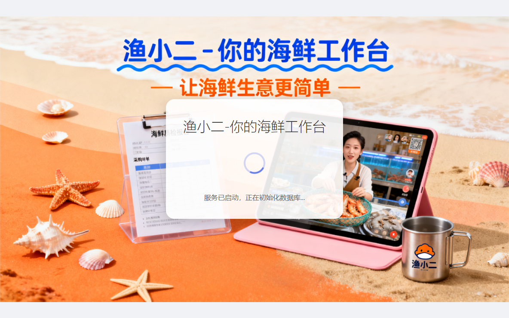
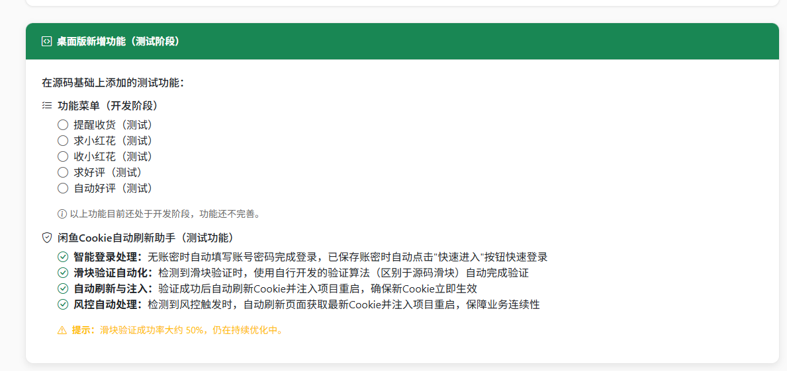
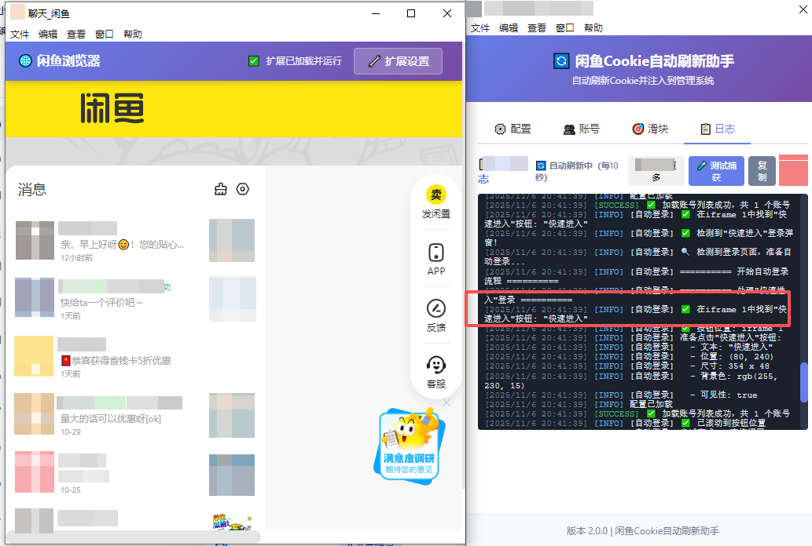
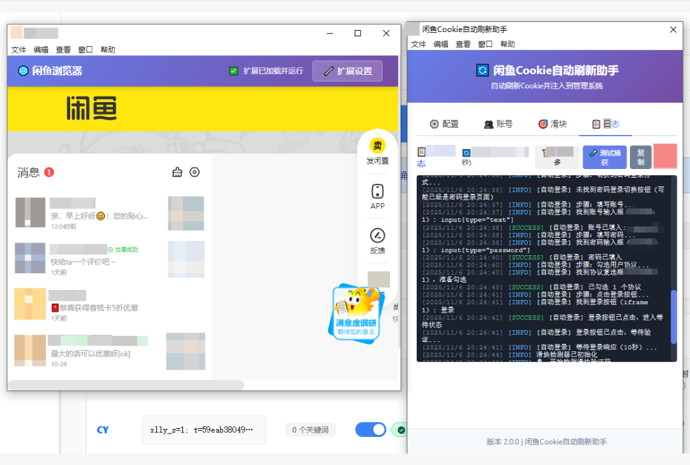
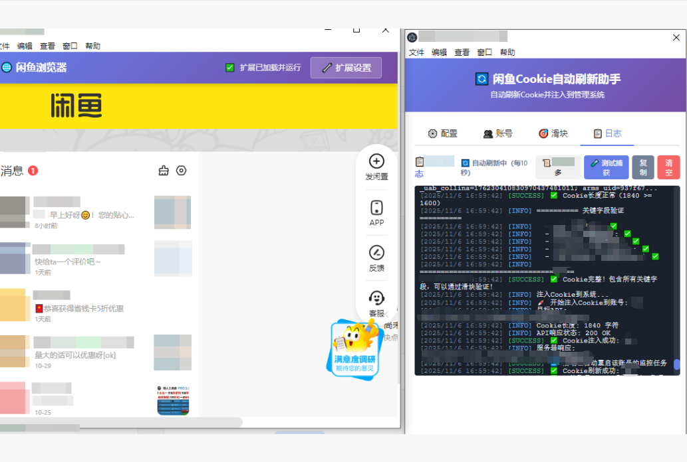

# 渔小二-你的海鲜工作台 - 桌面版

**功能强大的闲鱼自动化管理工具 - 桌面应用版本**

一键安装 • 开箱即用 • 简单易用(首次运行，请手动在仪表盘配置账号)

---

## 📖 简介

**渔小二-你的海鲜工作台** 桌面版是一款专为闲鱼卖家打造的自动化管理工具。通过简洁美观的桌面应用界面，让您轻松管理店铺、自动回复消息、处理订单，大幅提升工作效率。

### ✨ 核心亮点

- 🎯 **一键安装，开箱即用** - 双击安装，无需任何配置
- 🚀 **零技术门槛** - 图形化界面，所有功能点击即用
- 💪 **功能完整** - 涵盖消息回复、订单管理、评价提醒等全流程
- 🔒 **本地运行** - 数据存储在本地，安全可靠
- 🌐 **内置浏览器** - 无需安装Chrome，一切都已准备好

---

## 🎯 为什么选择桌面版？

### 与源码版本对比

| 优势 | 桌面版 | 源码版 |
|------|--------|--------|
| **安装难度** | ✅ 一键安装 | ❌ 需要配置Python环境 |
| **浏览器依赖** | ✅ 内置浏览器 | ❌ 需要安装Chrome和ChromeDriver |
| **启动方式** | ✅ 双击图标启动 | ❌ 需要运行命令行脚本 |
| **服务管理** | ✅ 自动启动和监控 | ❌ 手动启动后端服务 |
| **系统集成** | ✅ 托盘图标、开机自启 | ❌ 无系统集成 |
| **用户体验** | ✅ 现代化图形界面 | ❌ 命令行界面 |
| **适用人群** | ✅ 所有用户 | ❌ 技术用户 |

### 为什么选择我们

**对于新手用户**
- 无需学习任何技术知识
- 安装后即可使用，无需配置
- 遇到问题，界面会给出清晰提示

**对于专业卖家**
- 稳定可靠，可以7×24小时运行
- 自动处理Cookie刷新和验证
- 支持多账号管理
- 完整的日志记录，方便追踪

**对于团队使用**
- 统一的安装包，便于部署
- 标准化的操作流程
- 易于培训和推广

---

## 🎨 功能特性

### 🤖 智能自动回复

- **关键词回复** - 自动识别买家咨询，智能匹配回复内容
- **AI回复** - 支持接入智能AI，让回复更自然
- **场景模板** - 预设常见场景回复，一键开启
- **夜间模式** - 设置自动回复时间段，避免打扰

### 📦 订单自动管理

- **发货提醒** - 自动提醒买家确认收货
- **好评邀请** - 自动邀请买家好评和小红花
- **订单追踪** - 实时查看订单状态和物流信息
- **批量处理** - 支持批量发送提醒消息

### 🍪 Cookie智能管理

- **一键提取** - 内置浏览器，登录后一键提取Cookie
- **自动刷新** - Cookie过期自动提醒，支持自动刷新
- **滑块验证** - 智能处理滑块验证码，解放双手
- **多账号支持** - 管理多个闲鱼账号，轻松切换

### 🌐 内置浏览器

- **独立浏览器** - 完全内置，无需安装Chrome
- **扩展支持** - 支持Chrome扩展，功能更强大
- **隐私保护** - 独立会话，不影响您的日常浏览
- **操作便捷** - 集成在应用中，随时打开使用

### 📊 数据统计分析

- **消息统计** - 查看每日消息量和回复率
- **订单趋势** - 分析订单数据，把握经营状况
- **效率提升** - 直观展示自动化带来的时间节省

### 🔔 系统托盘集成

- **后台运行** - 最小化到托盘，不占用桌面空间
- **快速操作** - 右键托盘图标，快速访问功能
- **状态提示** - 实时显示服务运行状态
- **开机自启** - 支持开机自动启动，永不遗漏

---

## 🚀 快速开始

### Windows 用户（已完整测试）

1. **下载安装包**
   - 从发布页面下载 `渔小二-你的海鲜工作台-Setup-1.0.0.exe`

2. **安装应用**
   - 双击安装包
   - 按照安装向导完成安装
   - 首次安装约需要 1-2 分钟

3. **启动应用**
   - 双击桌面快捷方式
   - 或从开始菜单启动

4. **登录使用**
   - 默认账号：`admin`
   - 默认密码：`admin123`
   - 首次登录建议修改密码

5. **配置Cookie**
   - 点击界面右下角"🌐 浏览器控制"按钮
   - 在内置浏览器中登录闲鱼
   - 点击"提取Cookie"按钮
   - 完成配置，开始使用！

### Linux / macOS 用户（未经实测）

> **重要提示**：Linux 和 macOS 版本理论上支持，但未经过完整实测。如果您需要在这些平台使用，请自行测试验证。我们欢迎您反馈使用情况，帮助我们完善跨平台支持。

**为什么未测试？**
- 主要用户群体集中在 Windows 平台
- Linux/macOS 测试成本较高
- 跨平台构建已准备好，等待社区反馈

**如果您愿意尝试：**
1. 下载对应平台的安装包
2. 按照系统提示安装
3. 如遇问题，欢迎提交 Issue
4. 您的反馈将帮助我们改进

---

## 🖼️ 界面预览

### 登录界面

简洁美观的登录界面，支持记住密码和快速登录。背景图片可自定义，打造您的专属工作台。

---

### 启动页面

应用启动时的加载界面，显示服务初始化状态，让您清楚了解启动进度。

---

### 初始化页面

首次启动时，系统会自动完成必要的初始化工作，包括数据库创建、配置加载等。

---

### 主控制面板

清晰的功能布局，所有核心功能一目了然。侧边栏快速导航，顶部状态栏实时反馈。

---

### Cookie管理与自动登录

#### 快速进入页面

智能识别已登录状态，支持一键快速进入闲鱼IM页面。无需重复输入账号密码，大幅提升操作效率。

---

#### 自动账号密码填入登录

智能检测登录页面，自动填写保存的账号密码，并自动勾选用户协议。支持iframe弹窗登录，解放双手，让Cookie刷新全自动化。

---

#### 自动刷新CK并注入

Cookie过期时自动触发刷新流程，支持智能滑块验证处理。刷新成功后自动注入新Cookie到系统，整个过程无需人工干预，真正实现7×24小时不间断运行。

---

## ❓ 常见问题

### 安装相关

**Q：安装时提示"Windows 已保护你的电脑"？**

A：这是因为应用未经微软数字签名。请点击"更多信息"，然后选择"仍要运行"。我们的应用完全安全，您可以放心使用。

**Q：安装需要多大空间？**

A：完整安装约需要 300-500 MB 空间，建议预留 1 GB 以上。

### 使用相关

**Q：忘记登录密码怎么办？**

A：点击登录界面的"重置为默认账号"，使用默认账号密码（admin/admin123）登录，然后在设置中修改密码。

**Q：Cookie 多久需要更新一次？**

A：通常 Cookie 有效期为 7-30 天，应用会在 Cookie 即将过期时自动提醒您更新。

**Q：可以同时管理多个闲鱼账号吗？**

A：可以！在配置页面添加多个账号的 Cookie，应用会自动轮询处理。

**Q：会不会被闲鱼检测到使用自动化工具？**

A：我们采用了智能化的模拟机制，模仿真实用户行为。但建议合理设置回复频率，避免过于频繁的自动操作。

**Q：数据保存在哪里？**

A：所有数据都保存在您的本地电脑上，应用不会上传任何信息到云端，保证数据安全和隐私。

### 功能相关

**Q：自动回复会不会漏掉消息？**

A：不会。应用会实时监控消息，并按照您设置的规则自动回复。所有消息都会记录在日志中，方便您随时查看。

**Q：可以自定义回复内容吗？**

A：完全可以！在自动回复配置页面，您可以自由设置关键词和对应的回复内容，支持多条规则组合。

**Q：晚上也会自动回复吗？**

A：您可以在设置中指定自动回复的时间段，比如只在 9:00-22:00 之间自动回复，避免深夜打扰买家。

---

## 📝 使用建议

### 新手上路

1. **第一步**：安装应用并使用默认账号登录
2. **第二步**：配置您的闲鱼 Cookie
3. **第三步**：启用自动回复功能，设置简单的关键词回复
4. **第四步**：观察一天，查看自动回复效果
5. **第五步**：根据需要调整规则，逐步启用更多功能

### 进阶使用

1. **优化回复规则**：分析买家常见问题，建立完善的回复库
2. **接入 AI 回复**：让回复更智能、更人性化
3. **批量操作**：使用订单批量提醒功能，提高收货率
4. **数据分析**：定期查看统计数据，了解经营状况
5. **多账号管理**：如果您有多个店铺，可以统一管理

### 最佳实践

- ✅ **合理设置回复间隔**：建议设置 3-10 秒的随机延迟，更像真人
- ✅ **定期更新 Cookie**：虽然插件会自动更新，但插件无法运行的时候还是建议每天检查一次 Cookie 状态
- ✅ **查看日志记录**：每天查看一次日志，确保运行正常
- ✅ **及时更新版本**：关注新版本发布，及时更新获取新功能
- ✅ **备份重要数据**：定期备份数据库文件，防止数据丢失

---

## 🔄 更新日志

### v1.0.0（最新版本）

**新增功能**
- ✨ 内置 Chromium 浏览器，无需安装 Chrome
- ✨ Cookie 自动提取和管理功能
- ✨ 智能滑块验证处理
- ✨ Chrome 扩展支持
- ✨ WorkflowManager工作流管理系统，智能化任务调度
- ✨ 自动账号密码登录，支持弹窗识别
- ✨ 快速进入功能，一键跳转IM页面

**功能改进**
- 🎨 全新的登录界面设计
- 🎨 优化注册流程和界面
- ⚡ 提升应用启动速度
- ⚡ 优化内存占用
- 🚀 Cookie刷新流程优化，全自动化处理
- 🚀 风控事件智能处理，避免频繁刷新循环
- 🎯 登录检测优化，支持页面中的表单识别

**问题修复**
- 🐛 修复部分情况下服务无法启动的问题
- 🐛 修复托盘图标偶尔不显示的问题
- 🐛 修复登录按钮未点击的问题
- 🐛 修复风控事件循环触发的问题
- 🐛 修复iframe登录表单无法识别的问题

### v1.0.0

- 🎉 首个桌面版本发布
- ✅ 基础自动回复功能
- ✅ 订单管理功能
- ✅ 系统托盘支持

---

## 💡 获取帮助

### 遇到问题？

1. **查看常见问题**：本文档的常见问题部分可能已有答案
2. **查看日志**：点击应用菜单 → 帮助 → 查看日志
3. **提交 Issue**：在 GitHub 上提交问题报告
4. **联系支持**：通过社群获取帮助

### 建议反馈

我们非常重视您的意见和建议！

- 📧 功能建议
- 🐛 问题报告  
- 💬 使用体验
- ⭐ 给我们点个 Star

---

## 📜 许可证

本项目采用 MIT 许可证。

---

## 🙏 致谢

### 感谢项目作者

**知年博客**

本项目基于 **知年博客** 开发并开源的项目构建。

项目地址：[https://github.com/zhinianboke/xianyu-auto-reply](https://github.com/zhinianboke/xianyu-auto-reply)

### 项目说明

项目源码由 **知年博客** 开发并开源，如需要使用源码的请前往原作者处自行部署。

桌面版由 **渔小二** 打包整理，只是为方便更多的小白（例如本人）可以更加方便的使用，免去了项目部署过程中出现的不确定性的运行环境问题。

**注意：** 由于每个人的环境不一样，不保证适配所有的机器都能正常使用，关于项目源码的问题请自行前往项目原作者项目查找答案。

### 感谢所有用户

感谢所有使用和支持本项目的用户！

特别感谢：
- 所有提交 Issue 和建议的用户
- 所有分享使用经验的用户
- 所有帮助测试新版本的用户

---

**让闲鱼经营更轻松，让工作更高效**

Made with ❤️ by 渔小二团队

[⬆ 回到顶部](#渔小二-你的海鲜工作台---桌面版)

